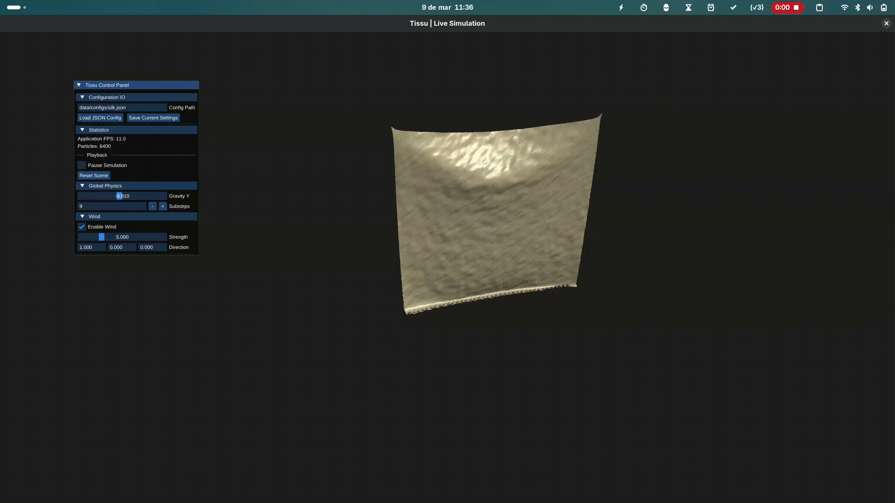

# 🧵 Tissu


**Tissu** is a C++ cloth simulation SDK designed to integrate seamlessly into Digital Content Creation (DCC) tools such as Blender. It was developed to make high-fidelity cloth simulation as accessible as possible for technical artists and developers.

By combining a high-performance **C++ core** with flexible **Python bindings**, Tissu allows you to script complex simulations, define materials via JSON, and export results directly to Alembic (.abc).


---

## 🛠️ Build and Installation

### 1. Clone Repositorie

Clone the repository is as simple as

```bash
git clone https://github.com/evanrock520-ciencias/Tissu.git
cd Tissu
```

### 2. Compile the SDK

Build the shared library and the standalone viewer using CMake.

```bash
mkdir build
cd build
cmake .. -DCMAKE_BUILD_TYPE=Release
make -j4 
```

### 3. Python Environment Setup

To import the library in your scripts, you must add the project path and the build artifact path to your `PYTHONPATH`.

**Linux / macOS:**

```bash
export PYTHONPATH=$PYTHONPATH:$(pwd)/python:$(pwd)/build
```

**Windows (PowerShell):**

```powershell
$env:PYTHONPATH = "$env:PYTHONPATH;$(Get-Location)\python;$(Get-Location)\build\Release"
```

> **Note:** Run this from the root of the repo

---

## 🚀 Getting Started with Python

Using the Python API, we can create a simulation scene, pin vertices, apply materials, and bake the result to a cache file.

Create a file named `simulation.py` on `examples` directorie:

```python
import cloth_sdk
from cloth_sdk import Simulation, Fabric, Material

def run_falling_curtain():
    # 1. Initialize Simulation Environment
    sim = Simulation(
        substeps=10,
        iterations=2,
        gravity=-9.81,
        thickness=0.1
    )

    # 2. Add Forces
    sim.wind = [4.0, 0.0, 0.0]
    sim.air_density = 0.1
    sim.add_floor()

    # 3. Define Fabric
    # You can define custom properties or use presets
    base_material = {
        "density": 0.1,
        "structural_compliance": 1e-9,
        "shear_compliance": 1e-8,
        "bending_compliance": 0.1
    }

    # Create a procedural grid mesh
    curtain = Fabric.grid(
        name="curtain",
        rows=200,
        cols=180,
        spacing=0.1,
        material=base_material,
        solver=sim.solver
    )

    # 4. Setup Scene
    sim.add_fabric(curtain)
    
    # Apply a preset (overrides previous material settings)
    Material.apply_preset(curtain, "silk")
    
    # Pin the top corners to hold the curtain
    curtain.pin_top_corners(sim.solver)

    out = "data/animations/falling.abc"

    # 5. Run and Bake
    sim.bake_alembic(
        filepath=out,
        start_frame=0,
        end_frame=96,
        fps=24
    )
    print(f"Done! Saved to {out}")

if __name__ == "__main__":
    run_falling_curtain()
```

You can run the script above by writting.

```bash
python3 -m examples.simulation
```

---

## Viewer



>Note: Preview of a silk cloth.

---

## 🎨 Blender Integration

Since Tissu exports standard Alembic files, visualizing the result is straightforward:

1.  Run the Python script above to generate the `.abc` file.
2.  Open **Blender**.
3.  Go to **File > Import > Alembic (.abc)**.
4.  Select `data/animations/falling.abc`.
5.  Press **Play**.

---

## 📄 License

This project is licensed under the Apache 2.0 License - see the [LICENSE](LICENSE) file for details.